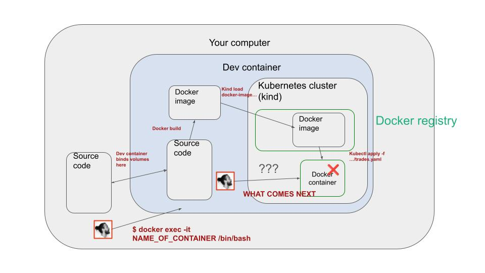

# Session 2

### Table of contents

- [1. Goals](#1-goals)
- [2. I have 3 questions for YOU](#2-i-have-3-questions-for-you)
- [3. Nuggets of wisdom](#3-nuggets-of-wisdom)
- [4. Video recordings and slides](#4-video-recordings-and-slides)
- [5. Further materials](#5-further-materials)
- [6. Homework](#6-homework)


## 1. Goals

- [x] Build a docker image for our `trades` service.
- [x] Deploy this image to our dev Kuberntes cluster
    - [x] Push the image to the docker registry
    - [x] Write a deployment.yaml file -> Kubernetes file
    - [x] Trigger the deployment with `kubectl apply -f ...` (manual deployment to start with)

- [x] Extract config parameters with pydantic-settings.

- [x] Automatic code linting and formatting with ruff and pre-commit.
    - [x] Install ruff and precommit using uv 
        ```sh
        # if you work outside the dev container you can install them as follows
        uv tool install ruff@latest
        uv tool install precommit@latest
        ```
    - [x] Set our precommit hooks
    - [x] Test it works.

- [x] Start building the candles service, that aggregates trades into candles.

    - [x] Boilerplate code of a streaming app with Quixstreams.
    - [ ] Check these fake candles get to the output topic (Kafka UI)
    - [ ] Implement the actual transformation with quixstreams window functions.

## 2. I have 3 questions for you

I would like to know:

1. What is your background?
2. What was the hardest thing for you in session 1?
3. What could I do better?

These are the anwers you gave me (thanks a lot for that!)


## 3. Nuggets of wisdom

### How to debug a pod that fails?

In this session I initially prepared this `trades.Dockerfile` to containerize our
`trades` service.

```Dockerfile
# trades.Dockerfile
# Use a Python image with uv pre-installed
FROM ghcr.io/astral-sh/uv:python3.12-bookworm-slim

# Install the project into `/app`
WORKDIR /app

# Enable bytecode compilation
ENV UV_COMPILE_BYTECODE=1

# Copy from the cache instead of linking since it's a mounted volume
ENV UV_LINK_MODE=copy

COPY services /app/services

# Install the project's dependencies using the lockfile and settings
RUN --mount=type=cache,target=/root/.cache/uv \
    --mount=type=bind,source=uv.lock,target=uv.lock \
    --mount=type=bind,source=pyproject.toml,target=pyproject.toml \
    uv sync --frozen --no-install-project --no-dev

# Then, add the rest of the project source code and install it
# Installing separately from its dependencies allows optimal layer caching
# Please, don't ask me why on Earth I decided to comment this out!
# ADD . /app
# RUN --mount=type=cache,target=/root/.cache/uv \
#     uv sync --frozen --no-dev

# Place executables in the environment at the front of the path
ENV PATH="/app/.venv/bin:$PATH"

# Reset the entrypoint, don't invoke `uv`
ENTRYPOINT []

# Run the FastAPI application by default
# Uses `fastapi dev` to enable hot-reloading when the `watch` sync occurs
# Uses `--host 0.0.0.0` to allow access from outside the container
CMD ["uv", "run", "/app/services/trades/src/trades/main.py"]

```

The Dockefile seemed ok, as I managed to build it without issues

```sh
docker build -t trades:dev .
```

I then pushed it into the container registry of our kind cluster
```sh
kind load docker-image trades:dev --name rwml-34fa
```

And finally deployed the app to the kind cluster, by writing a `deployment` manifest and
applying it to the Kubernetes cluster using the almighty `kubectl` tool
```sh
kubectl apply -f deployments/dev/trades/trades.yaml
```

However, when I moved to `k9s` I saw that the `pod` was failing, complaining the
`services/trades/src/trades/main.py` file was not found.

How do you debug this?

Let's do the following:

1. First, let's change the entrypoint of the container so we make sure we keep it running.

```Dockerfile
# Comment this out
# CMD ["uv", "run", "/app/services/trades/src/trades/main.py"]

# Add this line instead to keep the container running
# This will keep the container running and allow you to exec into it
CMD ["/bin/bash", "-c", "sleep 999999"]
```

2. Build the image again, load it into the kind cluster and deploy the app again

```sh
docker build -t trades:dev .
kind load docker-image trades:dev --name rwml-34fa
kubectl apply -f deployments/dev/trades/trades.yaml
``` 

3. Use `kubectl` to attach to the running container

```sh
kubectl exec -it <pod_name> -- /bin/bash
```

4. Check the file system

```sh
ls -la /app/services/trades/src/trades/main.py

ERROR!
```

Mmmm so no file there. Did I even copy the files?

And this is when I saw in the Dockerfile I commented out the line that copies the files
into the image.

```Dockerfile
# Please, don't ask me why on Earth I decided to comment this out!
# ADD . /app
```

If you uncomment this line, add the original entrypoint and rebuild the image, you will see that
it works.

Lessons: if a pod fails, and you want to debug it, you can use
```sh
kubectl exec -it <pod_name> -- /bin/bash
```
to get a shell into the container and check things out.

Moreover, if you are working inside the dev container, and you open a terminal session on your laptop,
you will first need to attach the terminal to the container.

```sh
docker exec -it <container_id> /bin/bash
```



## 4. Video recordings and slides

- [Video recordings](https://www.realworldml.net/products/building-a-real-time-ml-system-together-cohort-4/categories/2157424907)

- [Slides](https://www.realworldml.net/products/building-a-real-time-ml-system-together-cohort-4/categories/2157424907/posts/2186739148)


## 5. Further materials

- [Learn Kubernetes basics](https://kubernetes.io/docs/tutorials/kubernetes-basics/)
- [Kubernetes overview](https://kubernetes.io/docs/concepts/overview/)


## 6. Homework

- Rewrite the Dockerfile as a 2-stage build. If you manage to build an image with less than `300MB` you won (mine is `640MB`)

- Use secrets in the `trades.yaml` file instead of `env` parameters in the deployment. This is a bit of an overfkill here, but it is super
necessary when you want to pass things like API keys to your Python service.


