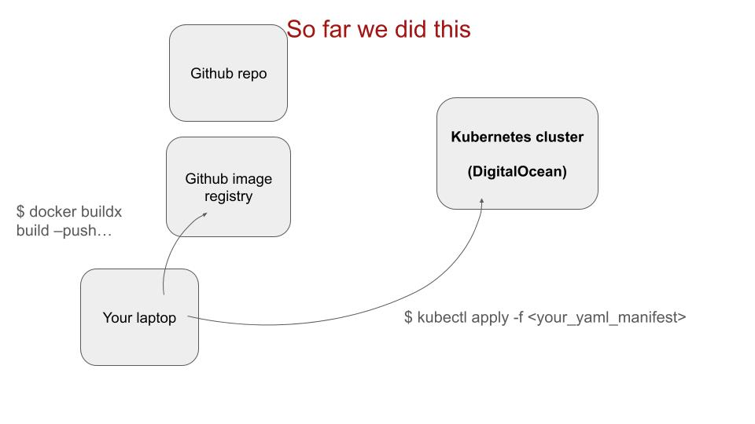
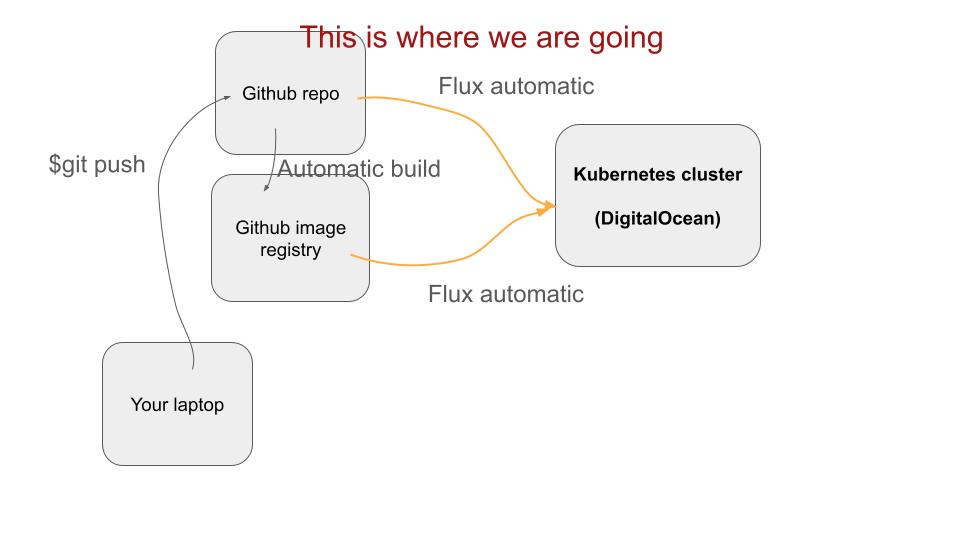
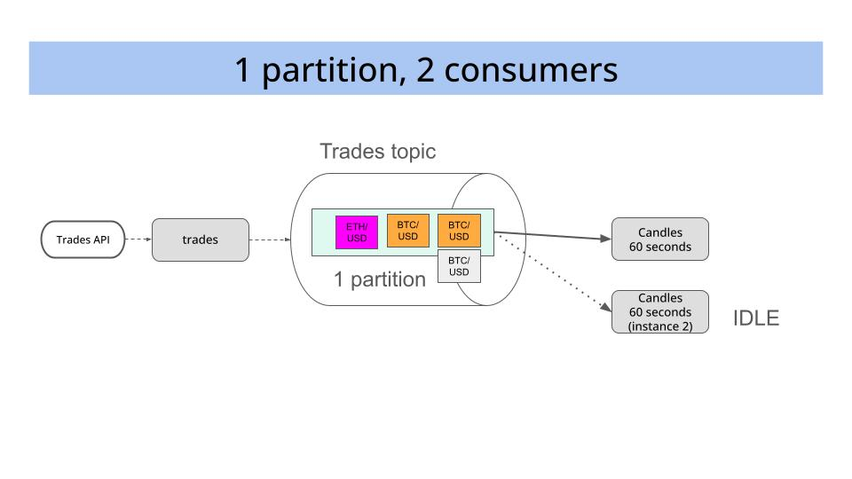
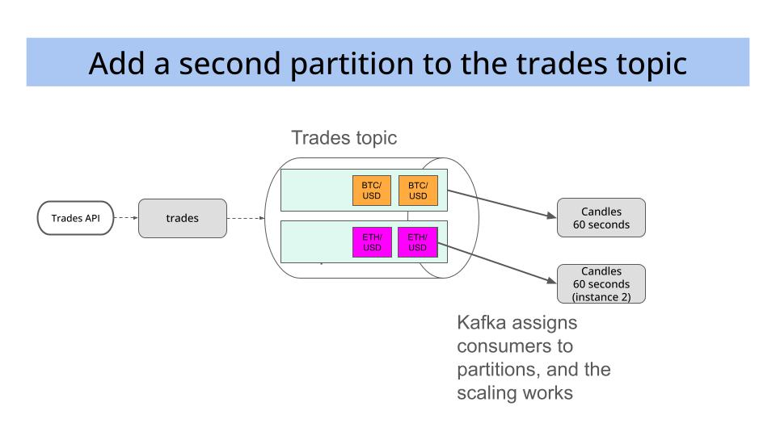

# Session 4 - Office Hours

### Table of Contents

- [1. Goals](#1-goals)
- [2. Questions and answers](#2-questions-and-answers)
- [3. Video recordings and slides](#3-video-recordings-and-slides)
- [4. Homework](#4-homework)

## 1. Goal

Shoot as many questions as you have and we will try to answer as many as possible.

## 2. Questions and answers

### Question by Saloni Gupta Ajay Kumar
In this course - what is the best way to learn the PROD stuff you showed - given that we don't have access

- to push packages into the github repo and
- we don't have the prod KUBECONFIG file in .kube folder

### Answer by Pau

To use Github image registry you first need to create a Personal Access Token (PAT) with
all repo permissions and write packages permissions.

Then, from the command line you need to authenticate with
```sh
docker login ghcr.io -u ${GITHUB_USER} -p ${GITHUB_PAT} 
```

And from here you can start pushing Docker images to the Github image registry
```sh
docker buildx build --push ....
```

So far we have deployed to Kubernetes manually, as shown in the image below.


Manually deploying to Kubernetes is a great way to understand the deployment process. However, it is not really manageable for a production environment, where you have to deploy many services and you need to deploy them frequently.

For that we will set up a CD pipeline that will automatically build the Docker images and push them to the Github image registry every time we make
a commit to the `main` branch, as shown in the image below.


Regarding the prod KUBECONFIG file, you can start a production cluster yourself using a cloud provider.

For example, I used [Civo](https://www.civo.com/) to create a production cluster. Once the cluster is created, you can download the `kubeconfig.yaml` file and use it to deploy the services to the production cluster.

The Kubernetes API is THE SAME for all clusters, whether they are local or remote.

This is why everything we do locally with `kubectl` will work in the production cluster.


### Question by Ming Sheng Choo
When you deployed to a production env(be it aws, or something like digital ocean), how do you actually monitor the kubenetes clusters, do you normally use cloudwatch + granafa so that it can be monitored?

### Answer by Marius
Low-level events
```sh
kubectl get events -A -w
```

Also from `k9s`, go to `:events`

At a higher-level, monitoring of logs and metrics

- Metrics: Prometheus. Kubernetes if Prometheus-ready, meaning it exposes metrics in a Prometheus friendly way.
- Logs: logz.io, free tier provides a fast way to get up and running with a production ready logs and metrics monitoring system.


### Question by Cristiano Monteiro
Morning Marius! I need some help with my candle replicas. Just one of them are consuming the items produced by trades. The other one stays waiting for incoming messages. Is there something to restart?

### Answer by Pau
Yes, that happens to me as well in the prod environment because the `trades` kafka topic has only 1 partition.

So you have this situation


To fix this, you should increase the number of partitions to 2


### Question by Lachezar Popov
Isn’t it better off to get the skeleton of the project structure in advance, similar to ZenML project structure.

```
.
├── configs                   # pipelines configuration files
│   ├── deployer_config.yaml  # the configuration of the deployment pipeline
│   ├── inference_config.yaml # the configuration of the batch inference pipeline
│   └── train_config.yaml     # the configuration of the training pipeline
├── pipelines                 # `zenml.pipeline` implementations
│   ├── batch_inference.py    # [CD] Batch Inference pipeline
│   ├── deployment.py         # [CD] Deployment pipeline
│   └── training.py           # [CT] Training Pipeline
├── steps                     # logically grouped `zenml.steps` implementations
│   ├── alerts                # alert developer on pipeline status
│   ├── deployment            # deploy trained model objects
│   ├── data_quality          # quality gates built on top of drift report
│   ├── etl                   # ETL logic for dataset
│   ├── hp_tuning             # tune hyperparameters and model architectures
│   ├── inference             # inference on top of the model from the registry
│   ├── promotion             # find if a newly trained model will be new inference
│   └── training              # train and evaluate model
├── utils                     # helper functions
├── .dockerignore
├── Makefile                  # helper scripts for quick start with integrations
├── README.md                 # this file
├── requirements.txt          # extra Python dependencies 
└── run.py                    # CLI tool to run pipelines on ZenML Stack
```

### Answer by Pau
There is not a one-size-fits-all project structure.

But there are some good practices that can help you.

Like, splitting:

- Configuration files
- Services. These are the microservices that make up your system, e.g. `trades`, `candles`, `technical_indicators`
- Libraries. These are the shared libraries that can be used by the services, e.g. `utils`, `common`, `ml_utils`

In this course we will have something like this:
```
.
├── deployments
│   ├── dev
│   │   ├── trades
│   │   ├── candles
│   │   └── technical_indicators
│   └── prod
│       ├── trades
│       ├── candles
│       └── technical_indicators
├── services # Python source code for the services
│   ├── trades
│   ├── candles
│   └── technical_indicators
├── libraries # Python source code for the libraries
│   └── llm
├── pyproject.toml # uv workspace to manage a single set of dependencies for all the services and libraries
├── uv.lock
├── docker # Dockerfiles for the services
│   ├── trades.Dockerfile
│   ├── candles.Dockerfile
│   └── technical_indicators.Dockerfile
├── Makefile
└── README.md
```

As for ZenML here are my 2 cents:

I think Flyte will help you fly higher.
https://github.com/flyteorg/flyte?tab=readme-ov-file#

Briges top-notch infra (aka Kubernetes) with the go-to language for ML (aka Python).


### Question by Shihab Ullah

Writing YAML files is not easy. How do I handle that?

Kubernetes GitOps fundamentals -> We want Marius to give us lesson!

### Answer by Marius

* If you are interested to see how we bootstrap the kind cluster with all the services
we use in this course, [check this](./02_manual_bootstrap_local_kubernetes_cluster.md)

* Helm is the pip of Kubernetes.

* 1-note Kind in a remoter server with 128MB of RAM and all the infra in [here](./02_manual_bootstrap_local_kubernetes_cluster.md)
is a production environment. For small workloads, yes.


### Question by José Miguel Vilches Fierro
I’m building a Docker image on two local Ubuntu servers. It’s built by the local Docker installation, not within containers. How can I view the build logs? I tried docker build logs but didn’t find anything useful

### Answer by Pau

Docker build logs are printed to the console.

You can also forward the logs to a file if you want to save them.
```sh
docker build -t my-image . > build.log 2>&1
```

### Question by Anton Javelosa
What's the best way to manage ports and port-forwarding? I often find myself getting lost when working between prod, dev, dev containers, local, etc.

### Answer by Pau
```sh
kubectl -n kafka port-forward svc/kafka 8182:8080
```

How to decide which external port to map to?
Pau: I just add one number at the beginning, for example I map the Kafka internal TCP port 9092 to localhost:19092


### Question by Saloni Gupta Ajay Kumar

Is changing the number of partitions through the kafka UI the only way to do so?

### Answer by Pau

No. You have other options:

1. Kafka UI (you already know that)
2. Quixstreams SDK when you start your streaming app
    ```python
    from quixstreams import Application
    from quixstreams.models import TopicConfig

    # Create an Application and tell it to create topics automatically
    app = Application(broker_address='localhost:9092', auto_create_topics=True)

    # Define input and output topics with custom configuration using
    input_topic = app.topic(
        name='input', config=TopicConfig(replication_factor=3, num_partitions=10),
    )
    ...
    ```

3. Use the `kafka-topics.sh` CLI that is installed in the Kafka pods inside your cluster.
    ```sh
    kubectl exec -it kafka-e11b-dual-role-0 -n kafka -c kafka -- bin/kafka-topics.sh --bootstrap-server kafka-e11b-kafka-bootstrap:9092 --topic first_topic --create --partitions 3 --replication-factor 1
    ```

What about pushing messages to Kafka?

Again, at least 2 options:

1. From Python using Quixstreams, either
    - `app.get_producer()` as we do in the `trades` service or
    - the `app.dataframe()` we use in the `candles` service

2. Use the [`kcat`](https://github.com/edenhill/kcat) CLI.
    * Produce a message to the `first_topic` from local with kcat
    ```sh
    echo "{'key': 'value'}" | kcat -b 127.0.0.1:9092 -P -t first_topic
    ```

    * Consume message from the `first_topic` from local with kcat.
    ```sh
    kcat -b 127.0.0.1:9092 -C -t first_topic
    ```

### Question by Tiamiyu Hamzat
If we are deploying to cloud-services like digital ocean, how do we get the address to kafka ui, I see we have a different address for our prod cluster

### Answer by Marius
The url and port where the service is available to outside traffic is something the ML Platform engineer (Marius) does using things like

- Kubernetes Ingress
- Kubernetes DNS

I will ask Marius for main steps to set this up.


### Question by Agi

How many services, that is kafka topics can we apply to kubernetes; do we have any limits per our current structure?

I apologies if this was already explained, but have missed it.

### Answer by Pau

You can have as many topics as you want, as long as you have enough disk space in your cluster to store all the messages in the topics.


### Question by Gerald PIERRE
Could you give an example of the benefits of using Flyte as orchestrator on top of what we are doing here?

### Answer by Pau
Two benefits I have seen:
* With simple Python annotations I can map different steps of an ML pipeline (feature, training, inference) to the right hardware.
For example, for LLM engineering, you can have the data preparation step on a CPU node, and the fine-tuning step on a GPU node.

* Observability and debugging. You can check each run on the Flyte dashbaord to understand inputs, output, and logs.

### Question by Karim Abousselham
I noticed that sometimes you code inside the devcontainer but sometimes you don't. Why is this?

### Answer by Pau
No strong reason. I just wanted to demonstrate that you have 2 options.

In my case, I like Cursor but unfortunately it does not play well with Devcontainers extension.

On the other hand, if you are on Windows I recommend you use the WSL (Windows Shell Linux) and the devcontainer with Visual Studio Code.


### Question by Ramon Botella Nieto
Hi, I'm getting the error about the tag ":dev" when deploying for dev, I remember you talked about this last session, but I do not remember what

### Answer by Pau
Problems installing the ta-lib library inside the Docker image.
We will solve that on Monday.

For the time being, just remove the talib dependenty from the`pyproject.toml` file.

### Question by Shihab Ullah
do we need to build multi-platform image for service when deploying in prod cluster? Wont it build the docker image automatically according to the prod node?

### Answer by Pau
My computer uses Apple Silicon (M2) processor while the production cluster uses x86_64.
This is why I add the `--platform linux/amd64` flag to the `docker buildx build` command, to ensure the Docker image is compatible with the production cluster.

## 3. Video recordings and slides

- [Video recordings](https://www.realworldml.net/products/building-a-real-time-ml-system-together-cohort-4/categories/2157467030)

- [Slides](https://www.realworldml.net/products/building-a-real-time-ml-system-together-cohort-4/categories/2157432311/posts/2186755976)

## 4. Homework

Do not push to the kind local registry, but the one on your Github account.

Today's first question and answer are related to this homework.

